<div style="text-align: justify;">

# Executive Summary

This project investigates the determinants of **impulsive online fashion buying behavior** among **Generation Z consumers** in Dhaka, Bangladesh. Using survey data from **160 participants**, the study examines how **external social pressures** (peer influence and perceived social status) and **internal personality traits** collectively drive unplanned fashion purchases on social commerce platforms.

Quantitative analysis was conducted entirely in **R**, using **Exploratory Data Analysis (EDA)** across 27 visualizations and **10 hypothesis tests** spanning multiple linear regression, simple linear regression, one-way ANOVA, Kruskal–Wallis, chi-square, and Welch's t-test. The analysis reveals a clear hierarchy of influence:

**Key Findings:**
* **Personality traits** are the dominant predictor of impulsive buying (β = 0.621, p < 0.001), explaining **32.69%** of variance alone.
* **Perceived social status** is a significant but secondary predictor (β = 0.186, p = 0.029).
* **Peer influence**, despite being statistically significant in isolation (p = 0.021), loses significance when controlling for the other predictors (p = 0.661)—suggesting it operates indirectly through social status rather than driving purchases directly.
* **Female respondents** exhibit significantly higher impulsivity than males (M = 3.22 vs 2.47, p < 0.001).
* **9 out of 10** null hypotheses were rejected; only payment method showed no significant association with impulsive buying.

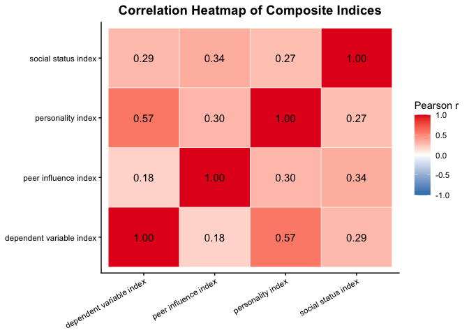
***Figure 01:** Correlation Heatmap of Composite Indices.*


# Research Problem

The rapid growth of social commerce platforms—particularly Facebook and Instagram—has transformed how Gen Z consumers in Dhaka discover and purchase fashion items. Impulsive buying on these platforms is fueled by algorithmic recommendations, peer-driven content, and frictionless payment options, yet the underlying psychological and social mechanisms remain underexplored in the Bangladeshi context.

The central research question addressed in this project is:

> ***What are the primary determinants of impulsive online fashion buying behavior among Generation Z consumers in Dhaka, and how do external social pressures and internal personality traits interact to drive unplanned purchases?***

Understanding these drivers enables:
* **Marketers** to design targeted campaigns that leverage mood-lifting content and post-purchase validation
* **Platforms** to understand which features (e.g., social proof, peer recommendations) amplify impulse buying
* **Researchers** to build on a quantitative foundation specific to the South Asian social commerce context
* **Consumers** to develop awareness of the psychological triggers behind their own unplanned spending


# Methodology

## Data Collection & Preparation

The dataset was collected via a structured survey of **160 Gen Z respondents** (aged 18–27) in Dhaka, covering demographics, shopping behavior, and Likert-scale measures across three independent variable constructs and one dependent variable construct.

**Survey Structure (25 questions):**
* **Demographics** (q1–q6): Age, gender, income, payment method, shopping frequency, platform preference
* **Peer Influence** (q7–q11): 5 Likert-scale items measuring susceptibility to peer pressure
* **Perceived Social Status** (q12–q15): 4 Likert-scale items measuring status-driven purchase motivation
* **Personality Traits** (q16–q22): 7 Likert-scale items measuring impulsivity, hedonic motives, and emotional triggers
* **Dependent Variable** (q23–q25): Frequency of unplanned purchases, unused purchases, and purchase regret

**Data Preparation Pipeline:**
1. **Factorization**: Converted ordinal variables (age, income, frequency) into ordered factors
2. **Composite Index Creation**: Built four composite indices by averaging Likert items within each construct
3. **Reliability Testing**: Verified internal consistency using **Cronbach's alpha** for all multi-item scales

## Analytical Framework

The analysis followed a two-phase approach:

**Phase 1 — Exploratory Data Analysis (27 visualizations)**
* Demographic and behavioral profiling (bar charts, stacked charts)
* Index distribution analysis (histograms, boxplots)
* Cross-index relationship mapping (scatterplots with regression lines, density plots)
* Correlation heatmap across all composite indices

**Phase 2 — Hypothesis Testing (10 hypotheses)**
* Multiple and simple linear regressions for continuous predictors
* One-way ANOVA with Tukey HSD post-hoc and Levene's assumption checks
* Kruskal–Wallis tests for small/uneven groups
* Chi-square test of independence (with Monte Carlo simulation)
* Welch's two-sample t-test for gender comparisons


# Exploratory Data Analysis

## Demographics & Basic Behavior

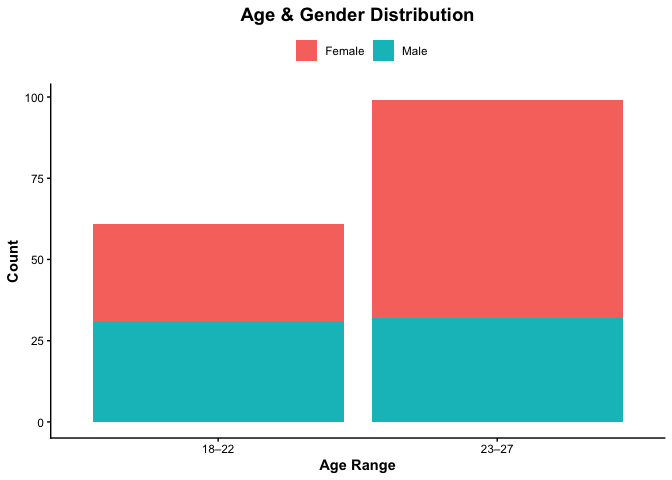
***Figure 02:** Age & Gender Distribution.*

The sample skews **female** (97 vs 63) and toward the **23–27** age band (99 vs 61 in 18–22). The imbalance is concentrated in 23–27, where females (67) more than double males (32); the 18–22 band is nearly even. The **28 and above** group is entirely absent.

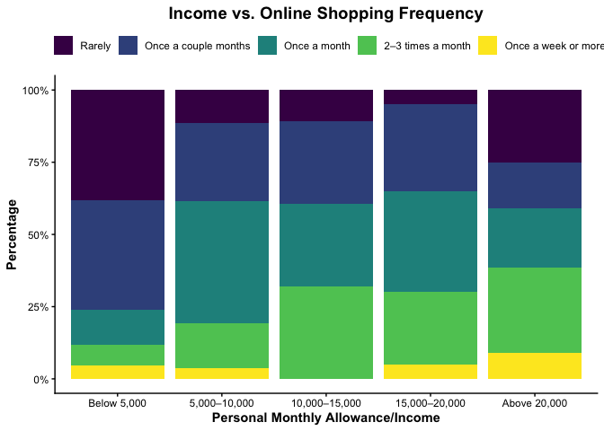
***Figure 03:** Income vs. Online Shopping Frequency.*

Lower-income respondents shop least often—in **Below 5,000**, 76% shop **Rarely** or **Once a couple months**. Purchase frequency rises with income, though weekly shopping remains rare across all income bands.

## Platform & Shopping Behavior

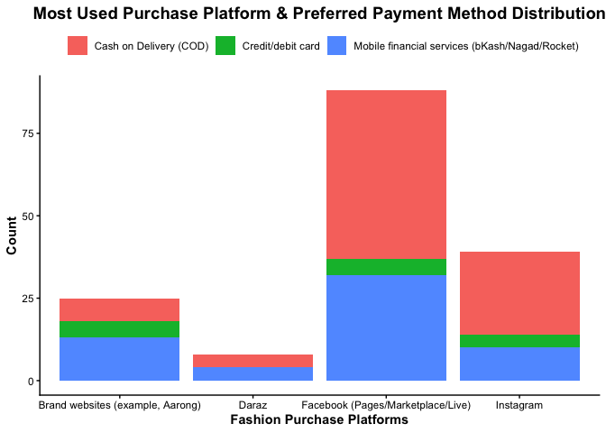
***Figure 04:** Most Used Purchase Platform & Preferred Payment Method Distribution.*

**Facebook** dominates (88 of 160), followed by **Instagram** (39). **Cash on Delivery** is the most common payment method overall, especially on Facebook (51 of 88 ≈ 58%). Interestingly, brand-website buyers lean toward **mobile financial services** rather than COD.

## Independent Variable Distributions

### Peer Pressure

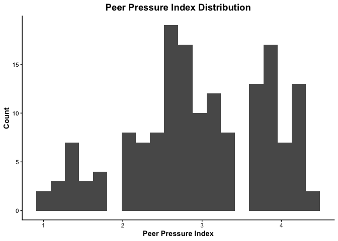
***Figure 05:** Peer Pressure Index Distribution.*

Centered near the scale midpoint (mean 2.96, median 3.0, SD 0.84). No respondent scores above 4.4 despite a 1–5 scale, suggesting few strongly peer-driven consumers.

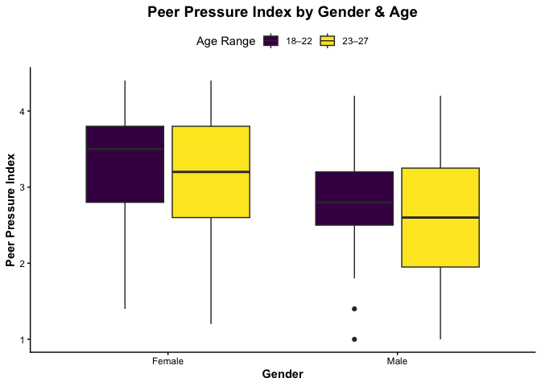
***Figure 06:** Peer Pressure Index by Gender & Age.*

Females report higher peer influence than males at both ages (medians ~3.2–3.5 vs ~2.6–2.8). The gender gap is larger than the age gap.

### Perceived Social Status

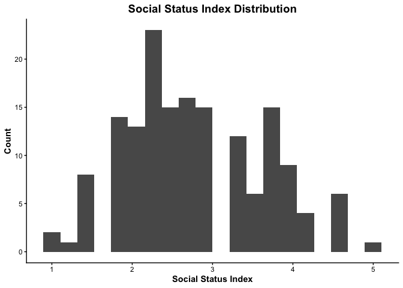
***Figure 07:** Social Status Index Distribution.*

Roughly central and symmetric (mean 2.78, median 2.75, SD 0.86), spanning the full 1–5 range.

### Personality Traits

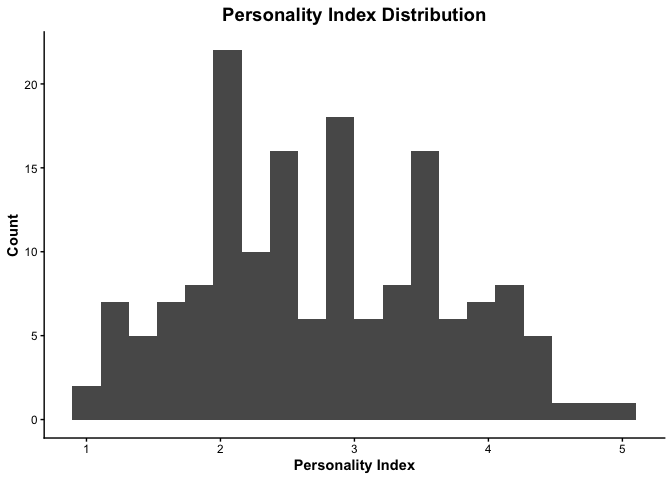
***Figure 08:** Personality Index Distribution.*

Mean 2.76, median 2.71, SD 0.90—the widest-spread predictor, covering the full 1–5 range. Females have a markedly higher median (3.0) than males (2.14–2.29), the largest and most consistent gender gap among the three indices.

## Key Predictor Relationships

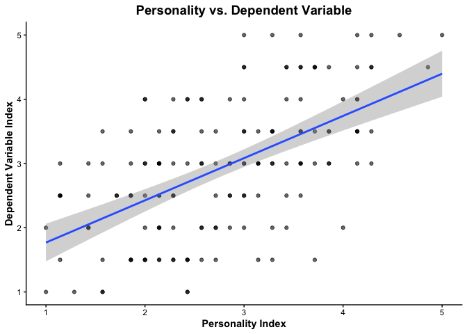
***Figure 09:** Personality vs. Dependent Variable.*

The **strongest association** of any predictor with the DV (r = 0.57). The positive slope is visibly tighter than the peer or status scatters, foreshadowing personality as the key predictor.

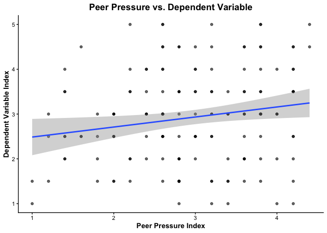
***Figure 10:** Peer Pressure vs. Dependent Variable.*

Peer influence correlates **weakly** with the dependent variable (r = 0.18)—the weakest of all predictors, an early hint that peer influence may not drive impulsive buying directly.

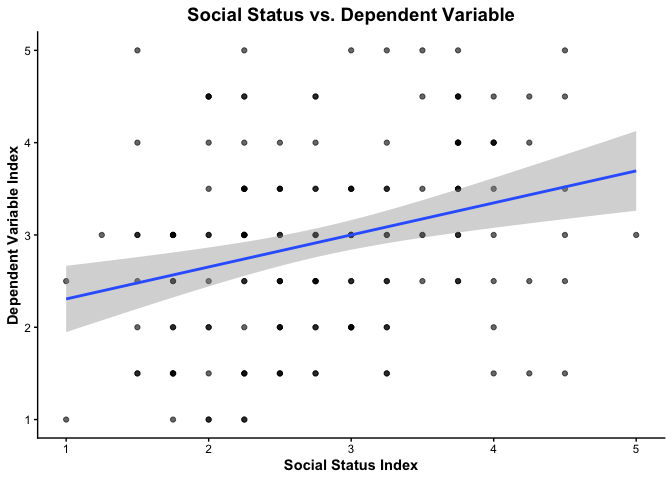
***Figure 11:** Social Status vs. Dependent Variable.*

Social status correlates **moderately** with the dependent variable (r ≈ 0.29)—stronger than peer influence but well below personality's standout association.

## Post-Purchase Outcomes

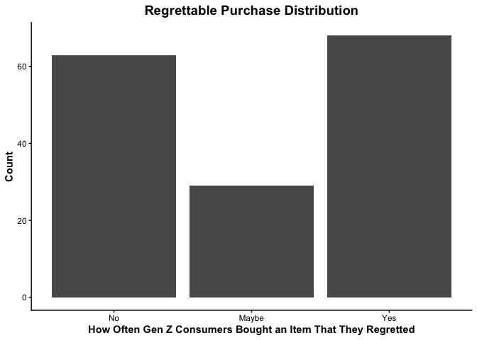
***Figure 12:** Regrettable Purchase Distribution.*

The distribution is **bimodal/polarized**—63 say **No** and 68 say **Yes**, with only 29 in the middle. Respondents tend to fall clearly into regret or no-regret camps.

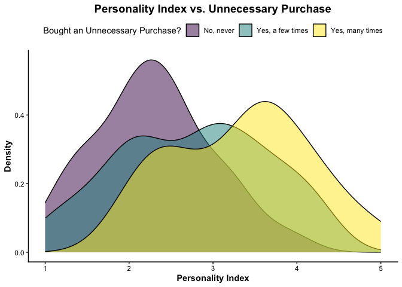
***Figure 13:** Personality Index vs. Unnecessary Purchase.*

Clearest gradient of all the density plots: mean personality rises 2.29 → 2.76 → 3.34 across **No**/**a few**/**many** unused purchases—consistent with an impulsivity interpretation.


# Hypothesis Testing Results

Ten hypotheses were tested using the appropriate statistical tests based on variable types and assumptions. A summary of all results:

***Table 01:** Summary of Hypothesis Testing Results.*

| No. | Hypothesis | Test Used | Result |
|----|----|----|-----|
| **01** | Peer Influence, Perceived Social Status, and Behavioral Traits jointly predict impulsive buying | Multiple Linear Regression | **Reject Null** |
| **02** | Behavioral Traits have no significant effect on impulse buying | Simple Linear Regression | **Reject Null** |
| **03** | Peer influence has no significant effect on impulsive buying | Simple Linear Regression | **Reject Null** |
| **04** | Perceived social status has no significant effect on impulse buying | Simple Linear Regression | **Reject Null** |
| **05** | Peer Influence has no significant effect on perceived social status | Simple Linear Regression | **Reject Null** |
| **06** | Impulsive buying does not differ by primary platform used | Kruskal–Wallis | **Reject Null** |
| **07** | Higher impulsivity is not associated with post-purchase regret | One-way ANOVA + Tukey HSD | **Reject Null** |
| **08** | No association between payment method and impulsive buying | Chi-Square (Monte Carlo) | **Cannot Reject Null** |
| **09** | Higher monthly allowance does not predict higher impulsive buying | One-way ANOVA + Tukey HSD | **Reject Null** |
| **10** | No gender difference in impulsive buying behavior | Welch's t-test | **Reject Null** |

### Key Findings from Hypothesis Testing

**1. Personality Traits Dominate (H1, H2)**
* The multiple regression model (H1) explains **34.73%** of variance in impulsive buying (p < 0.001). Personality traits (β = 0.621) and social status (β = 0.186) are significant, but **peer influence drops out** (β = -0.038, p = 0.661) when all three are modeled together.
* In isolation (H2), personality explains **32.69%** of variance—nearly all of the joint model's explanatory power comes from this single construct.

**2. Peer Influence Operates Indirectly (H3, H5)**
* Peer influence is significant alone (H3: p = 0.021) but explains only **3.31%** of variance. It significantly predicts perceived social status (H5: p < 0.001, R² = 11.52%), suggesting an **indirect pathway**: peer pressure → social status pressure → impulsive buying.

**3. Platform and Income Matter, Payment Method Does Not (H6, H8, H9)**
* Impulsive buying **differs by platform** (H6: p = 0.003), with Instagram users showing the highest impulsivity.
* Income significantly predicts impulsive buying (H9: p = 0.006), driven by the **Below 5,000** group scoring lower than all bands above 10,000.
* Payment method shows **no association** with impulsive buying (H8: p = 0.857)—the only null that was not rejected.

**4. Gender Gap and Regret (H7, H10)**
* Female respondents show significantly higher impulsivity than males (H10: M = 3.22 vs 2.47, p < 0.001).
* Higher impulsivity is significantly associated with post-purchase regret (H7: p < 0.001), driven specifically by the **Yes-regret** group scoring higher than the **No-regret** group.


# Conclusion

This study concludes that impulsive fashion buying among Dhaka's Gen Z is driven primarily by **internal psychological states** rather than external mechanics. The findings reveal a clear **driver hierarchy**:

**Primary Driver — Personality Traits**
* Strongest predictor across all analyses (r = 0.57, β = 0.621)
* Encompasses impulsivity, hedonic motivation, and emotional gratification seeking
* Shows the largest gender gap—females score markedly higher than males

**Secondary Driver — Perceived Social Status**
* Significant in both isolation and the joint model (β = 0.186, p = 0.029)
* Partially mediates the effect of peer influence on impulsive buying

**Indirect Driver — Peer Influence**
* Significant alone but loses predictive power when personality and status are controlled
* Operates primarily by intensifying social status pressure (R² = 11.52%)

**Moderating Factors**
* **Gender**: Female respondents exhibit significantly higher impulsivity (p < 0.001)
* **Platform**: Instagram users show the highest impulsive buying levels (p = 0.003)
* **Income**: A threshold effect—respondents below BDT 5,000 score lower, but no gradient exists above that level
* **Payment Method**: No significant association (p = 0.857)

**Strategic Insight:** Impulsive fashion consumption in Dhaka is a **cyclical process of mood regulation**—personality-driven consumers buy on impulse to regulate emotions, often experience regret, yet many rationalize their purchases as necessary or meaningful. Marketers should focus on creating **mood-lifting content** and providing **post-purchase validation** to neutralize consumer guilt, rather than relying solely on peer pressure tactics.

## Tech Stack & Tools

| Tool | Purpose |
|:-----|:--------|
| **R** | Statistical analysis and visualization |
| **tidyverse** | Data wrangling and ggplot2 visualizations |
| **readxl** | Excel data import |
| **psych** | Cronbach's alpha reliability testing |
| **car** | Levene's test for ANOVA assumption checking |
| **RMarkdown** | Reproducible research document |


## Repository Structure

```
├── impulse_buy.Rmd          # Main R Markdown analysis file (source)
├── impulse_buy.md           # GitHub-rendered markdown output
├── survey_response.xlsx     # Raw and clean survey data
├── assets/                  # All 27 generated plots
└── README.md                # This file
```

</div>